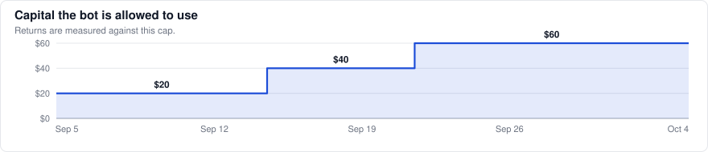
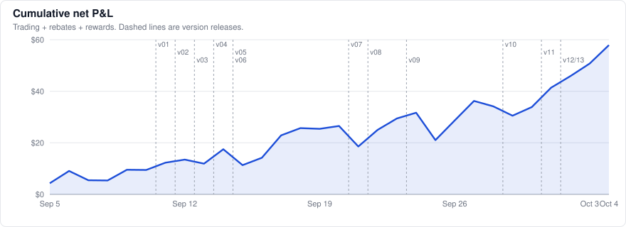
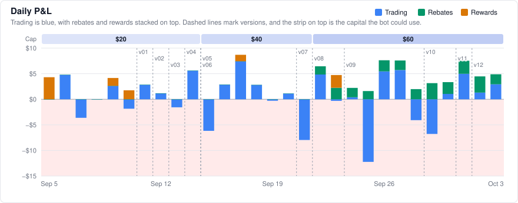
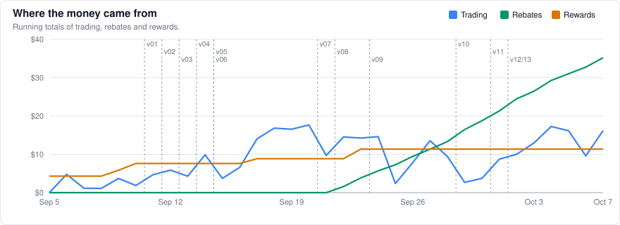
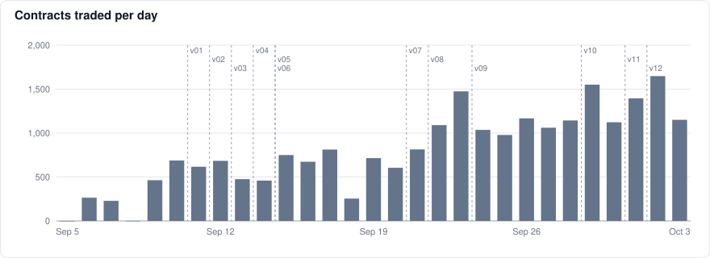
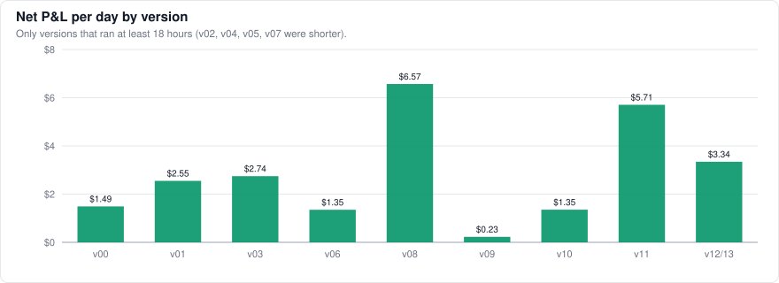
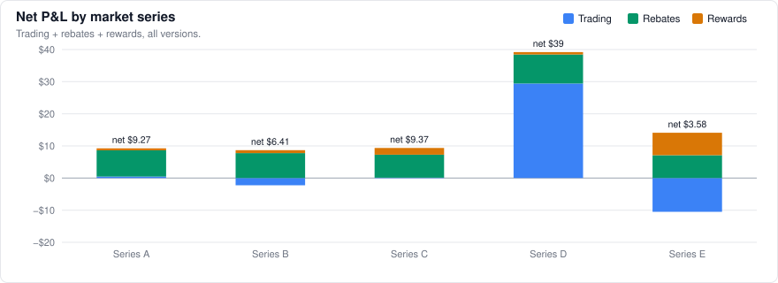

# prediction-market-making

This is a market-making bot that trades on Polymarket US with real money. It has been running since September 5, 2026, and it uses Kalshi's prices for the same markets as its fair value.

The repository has no code, only the results. **They update automatically every day at noon ET**, once the previous day's markets have settled, so everything here is current through yesterday.

Last update: October 5, 2026, 12:17 PM ET (30 days, September 5 to October 4).

## Returns

| | |
|---|---|
| Total return on capital | **+96.5%** (+$57.90 on the $60 cap) |
| Average daily return | **+5.2%** (each day against the cap at the time) |
| Last 7 days | **+5.2% per day** (+$21.65 total) |
| Current version (v12/13) | **+12.5% per day** since Oct 2 (only 2.6 days so far) |
| Days up | 20 of 30 (66.7%) |
| Days up, trading only | 18 of 30 (60.0%) |
| Best / worst day | +$8.70 (+21.7%) on Sep 17 / −$10.62 (−17.7%) on Sep 25 |
| Worst drawdown | −$10.62 (−17.7% of the cap) |

Where it came from:

| | |
|---|---|
| Trading | +$17.26 |
| Maker rebates | +$29.28 |
| Liquidity rewards (now rare) | +$11.36 |
| Fills / contracts | 17,176 / 24,586 |
| Capital the bot can use | $60 now (earlier: $20 from Sep 5 to Sep 14, $40 from Sep 15 to Sep 21) |

## About that return

The percentage return looks suspiciously high, and it is real, but it doesn't scale with size. Every so often a much better-informed buyer shows up. They already know which bracket is mispriced, and they buy a huge number of contracts at the stale price, mostly out of market makers' resting orders. The bigger those orders are, the bigger the hit, and one of those days can wipe out a lot of normal ones.

That is why the size stays small. I think the strategy is already close to its ceiling. Small improvements can still add something, but probably not much. I can't be sure of that, though. It's just how things look right now.

## How it works

The bot keeps buy and sell orders resting on both sides of every bracket. It makes money from the spread when both sides fill and from the maker rebate the exchange pays on each fill. Early on it also earned the exchange's liquidity rewards, but Polymarket has since changed the formula for those, and under the new one the bot rarely qualifies. Kalshi lists the same contracts with deeper books, so the bot takes its fair value from Kalshi instead of predicting anything itself.

Most of the losses come from getting picked off by traders who know something before the market does, and much of the version history is about limiting that.

On the risk side, each market has an inventory limit and the bot has a hard cap on capital. Quotes are pulled when Kalshi moves, a dead-man switch cancels everything if the bot stalls, and a soft stop winds positions down after a bad run. A watchdog checks on all of it every few minutes.

Every change ships as a new version. Before a version goes live, I write down what it should change and how I'll measure it, and each one runs for at least 48 hours before the next change.

## Charts

## Versions

| Version | Started (ET) | What changed | Days | Net | Net/day | Return/day | Trading | Rebates | Contracts |
|---|---|---|---:|---:|---:|---:|---:|---:|---:|
| v00 | Sep 5, 11:34 AM | First version: a $20 test run that quotes both sides of every bracket off Kalshi prices. | 5.6 | +$8.39 | +$1.49 | +7.5% | +$0.78 | $0.00 | 1,698 |
| v01 | Sep 11, 2:33 AM | Joins the queue at the best price and goes after the liquidity rewards. | 1.8 | +$4.56 | +$2.55 | +12.8% | +$4.56 | $0.00 | 1,200 |
| v02 | Sep 12, 9:28 PM | Detects exchange halts and settled markets, and reports its safety limits to the monitor. | 0.2 | +$0.55 | too short | too short | +$0.55 | $0.00 | 91 |
| v03 | Sep 13, 1:39 AM | Waits for fill confirmation before taking on more risk (added after an exchange data outage). | 1.8 | +$4.85 | +$2.74 | +13.7% | +$4.85 | $0.00 | 862 |
| v04 | Sep 14, 8:03 PM | Combines the fixes above into a single build. | 0.3 | −$5.58 | too short | too short | −$5.58 | $0.00 | 87 |
| v05 | Sep 15, 4:04 AM | Raises the cap to $40 to cover more markets at the same order size. | 0.5 | −$0.72 | too short | too short | −$0.72 | $0.00 | 504 |
| v06 | Sep 15, 3:48 PM | Pulls resting quotes as soon as Kalshi moves. | 6.1 | +$8.23 | +$1.35 | +3.4% | +$6.97 | $0.00 | 3,951 |
| v07 | Sep 21, 6:08 PM | Restarts the bot as a long-running service, with no logic changes. | 0.7 | −$2.95 | too short | too short | −$2.95 | $0.00 | 358 |
| v08 | Sep 22, 10:11 AM | Uses larger orders and raises the cap to $60. | 1.7 | +$11.48 | +$6.57 | +11.0% | +$5.03 | $3.96 | 2,438 |
| v09 | Sep 24, 4:07 AM | Adds a soft stop that winds positions down after a losing stretch. | 5.2 | +$1.18 | +$0.23 | +0.4% | −$8.58 | $9.76 | 5,563 |
| v10 | Sep 29, 8:51 AM | Uses larger orders again. | 2.1 | +$2.79 | +$1.35 | +2.3% | −$2.95 | $5.74 | 2,793 |
| v11 | Oct 1, 10:16 AM | Drops an outside model input, so fair value comes from Kalshi alone. | 1.0 | +$5.53 | +$5.71 | +9.5% | +$3.08 | $2.45 | 1,328 |
| v12/13 | Oct 2, 9:32 AM | Quotes only same-day markets, so nothing is held overnight. v13 adds a small safety fix for wind-downs. | 2.6 | +$19.59 | +$7.53 | +12.5% | +$12.22 | $7.37 | 3,712 |

Versions that ran for less than about 18 hours say "too short" instead of per-day figures and aren't in the chart, since stretching a few hours into a full day isn't meaningful. Return per day is measured against the cap that applied at the time.

## By market series

Each series is one recurring daily market with a few brackets each day. I've left out which markets they are on purpose.

| Series | Fills | Contracts | Trading | Rebates | Rewards | Net |
|---|---:|---:|---:|---:|---:|---:|
| A | 3,485 | 5,005 | +$4.60 | $6.02 | $0.64 | +$11.26 |
| B | 3,263 | 4,498 | +$0.91 | $6.00 | $0.90 | +$7.81 |
| C | 2,767 | 3,872 | −$2.97 | $4.94 | $2.09 | +$4.06 |
| D | 4,327 | 6,301 | +$22.38 | $6.46 | $0.74 | +$29.58 |
| E | 3,334 | 4,909 | −$7.66 | $5.86 | $6.99 | +$5.19 |

## Daily log

| Date | Version | Fills | Contracts | Trading | Rebates | Rewards | Net | Return | Total |
|---|---|---:|---:|---:|---:|---:|---:|---:|---:|
| 2026-10-04 | v12/13 | 587 | 1,271 | +$4.32 | $2.83 | $0.00 | +$7.15 | +11.9% | +$57.90 |
| 2026-10-03 | v12/13 | 490 | 1,150 | +$2.92 | $1.96 | $0.00 | +$4.88 | +8.1% | +$50.76 |
| 2026-10-02 | v12/13 | 755 | 1,648 | +$1.32 | $3.16 | $0.00 | +$4.48 | +7.5% | +$45.87 |
| 2026-10-01 | v11 | 570 | 1,395 | +$4.97 | $2.56 | $0.00 | +$7.53 | +12.5% | +$41.40 |
| 2026-09-30 | v10 | 475 | 1,123 | +$1.05 | $2.30 | $0.00 | +$3.35 | +5.6% | +$33.87 |
| 2026-09-29 | v10 | 690 | 1,550 | −$6.78 | $3.15 | $0.00 | −$3.63 | −6.1% | +$30.51 |
| 2026-09-28 | v09 | 635 | 1,143 | −$4.09 | $1.98 | $0.00 | −$2.11 | −3.5% | +$34.15 |
| 2026-09-27 | v09 | 599 | 1,060 | +$5.71 | $1.87 | $0.00 | +$7.58 | +12.6% | +$36.25 |
| 2026-09-26 | v09 | 651 | 1,167 | +$5.45 | $2.18 | $0.00 | +$7.63 | +12.7% | +$28.67 |
| 2026-09-25 | v09 | 546 | 978 | −$12.23 | $1.61 | $0.00 | −$10.62 | −17.7% | +$21.04 |
| 2026-09-24 | v09 | 587 | 1,036 | +$0.39 | $1.83 | $0.00 | +$2.22 | +3.7% | +$31.67 |
| 2026-09-23 | v08 | 900 | 1,474 | −$0.31 | $2.25 | $2.49 | +$4.43 | +7.4% | +$29.45 |
| 2026-09-22 | v08 | 774 | 1,090 | +$4.85 | $1.60 | $0.00 | +$6.45 | +10.7% | +$25.02 |
| 2026-09-21 | v06 | 839 | 814 | −$7.96 | $0.00 | $0.00 | −$7.96 | −19.9% | +$18.57 |
| 2026-09-20 | v06 | 622 | 604 | +$1.11 | $0.00 | $0.00 | +$1.11 | +2.8% | +$26.54 |
| 2026-09-19 | v06 | 731 | 715 | −$0.29 | $0.00 | $0.00 | −$0.29 | −0.7% | +$25.42 |
| 2026-09-18 | v06 | 262 | 254 | +$2.81 | $0.00 | $0.00 | +$2.81 | +7.0% | +$25.71 |
| 2026-09-17 | v06 | 834 | 812 | +$7.44 | $0.00 | $1.26 | +$8.70 | +21.7% | +$22.90 |
| 2026-09-16 | v06 | 689 | 673 | +$2.87 | $0.00 | $0.00 | +$2.87 | +7.2% | +$14.20 |
| 2026-09-15 | v05 | 804 | 750 | −$6.17 | $0.00 | $0.00 | −$6.17 | −15.4% | +$11.33 |
| 2026-09-14 | v03 | 505 | 459 | +$5.60 | $0.00 | $0.00 | +$5.60 | +28.0% | +$17.50 |
| 2026-09-13 | v03 | 496 | 475 | −$1.58 | $0.00 | $0.00 | −$1.58 | −7.9% | +$11.90 |
| 2026-09-12 | v01 | 726 | 683 | +$1.17 | $0.00 | $0.00 | +$1.17 | +5.9% | +$13.48 |
| 2026-09-11 | v01 | 658 | 617 | +$2.83 | $0.00 | $0.00 | +$2.83 | +14.1% | +$12.31 |
| 2026-09-10 | v00 | 736 | 688 | −$1.84 | $0.00 | $1.76 | −$0.08 | −0.4% | +$9.48 |
| 2026-09-09 | v00 | 503 | 463 | +$2.62 | $0.00 | $1.54 | +$4.16 | +20.8% | +$9.56 |
| 2026-09-08 | v00 | 2 | 1 | −$0.06 | $0.00 | $0.00 | −$0.06 | −0.3% | +$5.40 |
| 2026-09-07 | v00 | 237 | 229 | −$3.62 | $0.00 | $0.00 | −$3.62 | −18.1% | +$5.46 |
| 2026-09-06 | v00 | 273 | 264 | +$4.78 | $0.00 | $0.00 | +$4.78 | +23.9% | +$9.09 |
| 2026-09-05 | v00 | 0 | 0 | +$0.00 | $0.00 | $4.31 | +$4.31 | +21.5% | +$4.31 |

## Notes

- The raw data is in [`data/daily.csv`](data/daily.csv), [`data/versions.csv`](data/versions.csv) and [`data/series.csv`](data/series.csv).
- P&L is booked to the day each trade happened and valued at the official settlement price. Taker fees count against trading. Liquidity rewards are paid per market day, so they're booked to that day. Each day appears the morning after, once it has settled.
- The bot can only use $60 (less during the first two weeks, as the chart above shows). The rest of the account sits idle, so returns are measured against the cap.
- Each update is checked against the actual account balance before it's published. The last check was off by $0.26, which comes from open positions and rounding.
- This repository doesn't contain any code, keys, order data or strategy settings.
